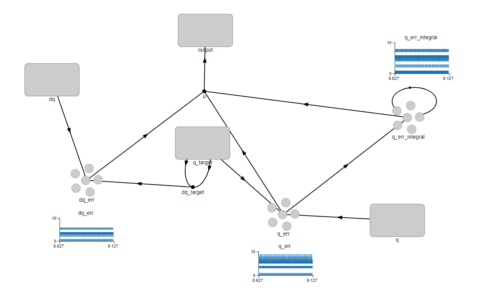

# Running MulticopterSim with Nengo

This directory contains code to support an altitude-hold PID controller using
the [Nengo](https://www.nengo.ai/) neural simulation package.  To use this
module, you should take the following steps:

1. Install Nengo.

2. Clone the [master branch](https://github.com/simondlevy/MulticopterSim) of the MulticopterSim repository.

3. Clone the  [SocketModule](https://github.com/simondlevy/MulticopterSim/tree/SocketModule)
branch of MulticopterSim in a folder called <b>FlightModule</b> in the
<b>MulticopterSim/Source</b> folder.  

4. Follow the [directions](https://github.com/simondlevy/MulticopterSim#windows) for building MulticopterSim
and choosing a vehicle.

5. In <b>MulticopterSim/Extras/nengo</b> folder, run <tt>python3 takeoff.py</tt>, and click the play button.
