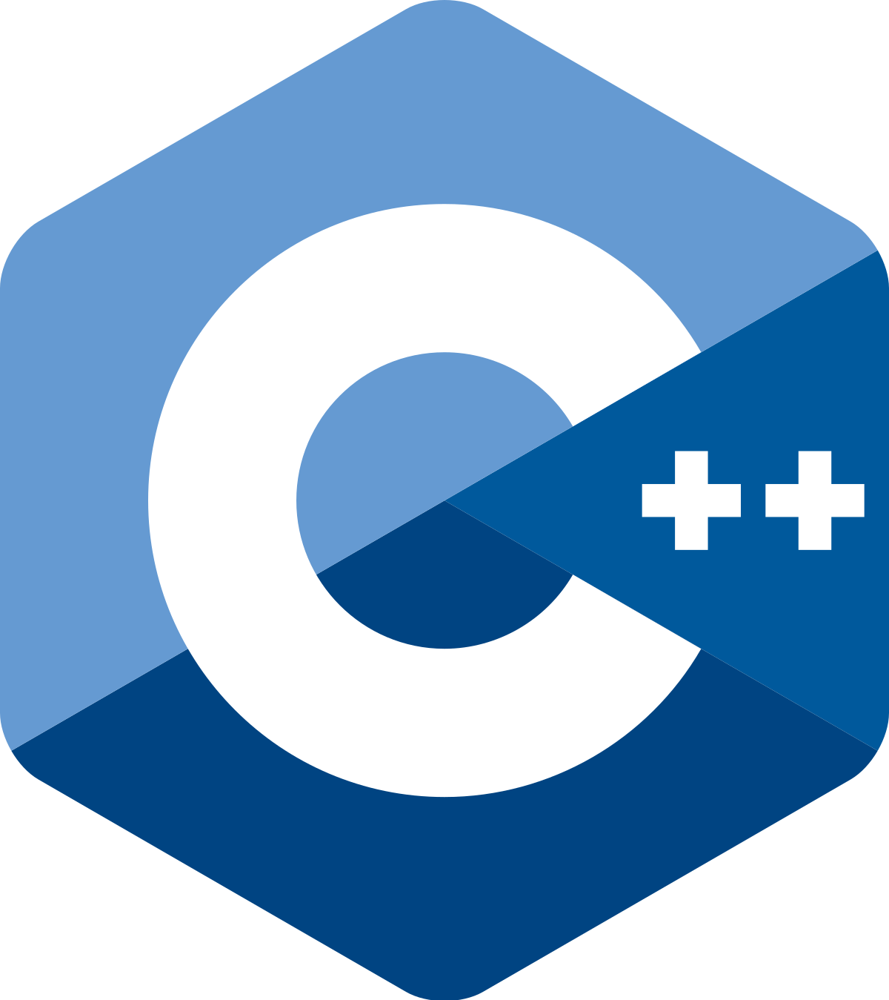

## C++ flight controller for MultiSim

The flight controller in this directory uses
[Hackflight](https://github.com/simondlevy/Hackflight),
a C++ flight-control package that also runs on actual vehicles.  This flight controller
makes use of the commands from your game controller / joystick / RC transmitter (open-loop control)
as well as PID controllers for angle, yaw, and altitude-hold (closed-loop control).

To try out 
this code, first install Hackflight; then edit the top line in the 
[Makefile](https://github.com/simondlevy/MultiSim/blob/master/FlightControllers/cpp/Makefile#L9-L10)
to correspond to where you installed it.  Once you've done that, type <b>make run</b> and start
the simulator as you did with the Python flight controller.
