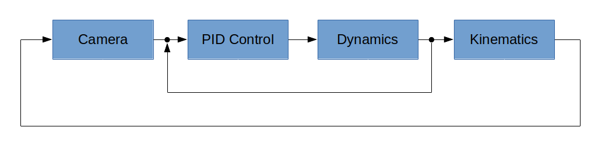

# About

MultiSim is a simple multicopter flight simulator using Unreal Engine.  It runs on Windows, using UDP
sockets to communicate vehicle state and camera images with flight-control programs
written in various languages.  This approach supports rapid prototyping of flight-control
algorithms without having to recompile the simulator itself.

# Prerequisites

## Hardware

I am currently developing MultiSim on an HP Z440 workstation with 32GB
RAM and NVIDIA GeForce GTX 1080 Ti. It may however be possible to develop on a
less &ldquo;loaded&rdquo; machine &ndash; see
[here](https://docs.unrealengine.com/4.27/en-US/Basics/InstallingUnrealEngine/RecommendedSpecifications/)
for the minimum requirements recommended by Unreal Engine.

For a realistic flying experience, you will also likely want some sort of game
controller or R/C transmitter.  MultiSim currently supports the following controllers
through the
[Joystick](https://github.com/simondlevy/MultiSim/blob/master/Source/MultiSim/Joystick.h)
class:

* PS4 controller
* XBox One controller
* XBox 360 controller
* XBox 360 controller clone
* PS3 controller clone
* Logitech Extreme Pro 3D joystick
* Logitech F310 gamepad
* FrSky Taranis TX9 RC transmitter with mini USB cable 
* FrSky XSR-Sim dongle
* Spektrum WS1000 dongle
* Great Planes RealFlight Interlink

If you don't have a controller, MultiSim will use input from the numeric keypad on your keyboard (make sure
that NumLock is turned on!)
The key mappings are based on those used in [Microsoft Flight Simulator](https://www.flightsimbooks.com/flightsimhandbook/keyboardcontrols.php#:~:text=Microsoft%20Flight%20Simulator%20Handbook%20%20%20Control%20,%20Keypad%202%20%2043%20more%20rows%20i).

## Toolchain

You will need Unreal Engine 5 (UE5). I am attempting to use the latest version, which as of the time of this
writing is UE5.0.1. To install UE5, follow these [instructions](https://docs.unrealengine.com/en-US/GettingStarted/Installation/index.html).
Because of
[problems](https://forums.unrealengine.com/t/unhandled-exception-when-building-blank-project-version-1-2-is-not-supported-version/510668/17)
getting UE5 to work with Visual Studio 2022, I have opted to stay with Visual Studio
2019 for the time being.

# Building

1. Clone this repository. 

2. Right-click on the <b>Simulator/MultiSim.uproject</b> 
file and select <b>Generate Visual Studio project file</b> to generate a <b>.sln</b> file

3. Double-click on the resulting <b>MultiSim.sln</b> file to launch VisualStudio.  The first time
you do this, you may have to wait a few minutes while Visual Studio parses up all of the UE5 files needed
to build the project.

4. In VisualStudio, hit the F5 key to build the project and launch UnrealEditor.

5. In UnrealEditor, select one of the maps in <b>Content Drawer/MultiSim/Maps</b>. Then open the
<b>Content/C++ Classes/MultiSim/pawns</b> folder and drag one of the
vehicle pawns into the map. 

# Testing

Run the <b>launch.py</b> script in <b>FlightControllers/python/</b>.  It will tell you to hit the Play
button back in the simulator.  When you hit the button, the vehicle should rise quickly to an altitude of 10 meters.

# Image processing

If you have Python OpenCV installed on your computer, you can try out the simulated camera feature of MultiSim by 
un-commenting the
<tt><a href="https://github.com/simondlevy/MultiSim/blob/master/Source/MultiSim/vehicles/Phantom.cpp#L21-L22">vehicle.addCamera()</a></tt>
line in the source code.  Running the Python launch program again, you should see a 640x480 image showing edge detection in 
OpenCV.  This feature can be glitchy the first time you try it.

# Support for other languages

The [FlightControllers](https://github.com/simondlevy/MultiSim/tree/master/FlightControllers)
directory contains code and instructions for different kinds of flight controllers written in various languages.

# Design principles

The core of MultiSim is the C++ 
[FlightManager](https://github.com/simondlevy/MultiSim/blob/master/Source/MultiSim/FlightManager.hpp) 
class. This class provides support for running the vehicle dynamics and the PID control
regime on its own thread, after it first disables the
built-in physics in UE5.  The dynamics I used are based directly on the model
presented in this [paper](https://infoscience.epfl.ch/record/97532/files/325.pdf), 
written as a standalone, header-only C++ 
[class](https://github.com/simondlevy/MultiSim/blob/master/Source/MultiSim/Dynamics.hpp)
that can be easily adapted for other simulators and applications if desired.
This class also supports different frame configurations (quadcopter,
hexacopter) via virtual methods. By running the FlightManager on its own
thread, I am able to achieve arbitrarily fast updates of the dynamics and
flight-control.  It would also be possible to run the dynamics and control on
separate threads, though I have not yet found it advantageous to do that.

The
[Camera](https://github.com/simondlevy/MultiSim/blob/master/Source/MultiSim/Camera.hpp)
class can be instantiated to transmit
the images collected by a simulated gimbal-mounted camera on the vehicle, using
a library like OpenCV.  Computer-vision algorithms running in a Camera subclass can then be used
as input to the PID control running in the FlightManager.  The following figure
illustrates this arrangement, using a traditional
[cascade-control](https://controlguru.com/the-cascade-control-architecture/)
(slow outer loop / fast inner loop) diagram:

</a>
